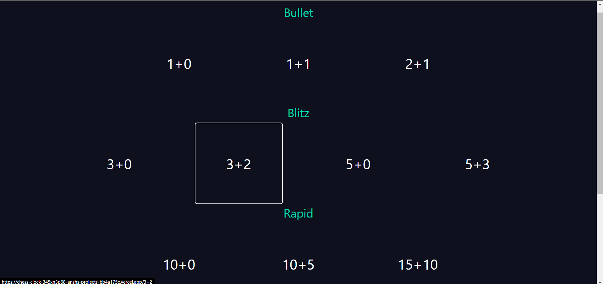
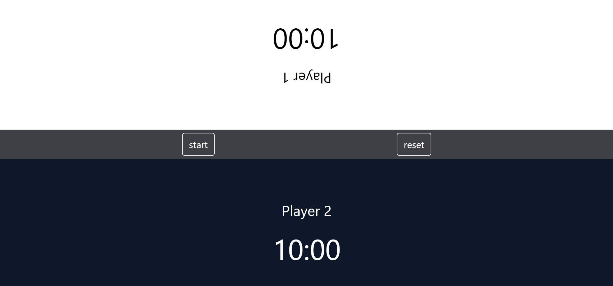
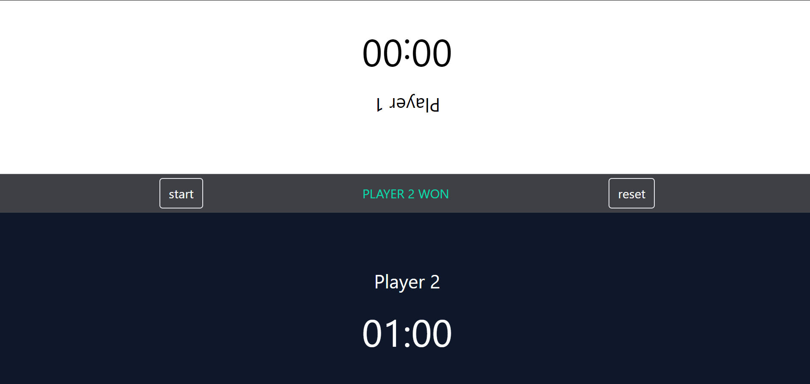

# Chess Clock

### June 2024

## Project Overview
Chess Clock is a web application designed to provide a digital alternative to physical chess clocks. It features customizable timers suitable for various chess formats including rapid (15+10), blitz (3+2), classical (30+30), and bullet (1+0). The application ensures usability on both desktop and mobile views, enhancing accessibility and convenience for chess players.

## Features
- **Customizable Timers**: Set timers for different chess formats including rapid, blitz, classical, and bullet.
- **Mobile View Usability**: Designed to be fully functional on mobile devices, ensuring players can use the app anywhere.
- **Accurate Timing**: Mimics the precision of physical chess clocks, providing increment options suitable for competitive play.
- **User-Friendly Interface**: Intuitive design making it easy to navigate and use.

## Tools and Technologies
- **React.js**: Utilized for creating dynamic user interfaces.
- **Tailwind CSS**: Employed for responsive design, ensuring optimal performance and modern aesthetics.

## Project Details
- **React.js**: Provides a robust framework for building the dynamic and responsive elements of the application.
- **Tailwind CSS**: Facilitates rapid styling and ensures that the application looks great on all devices.
- **Responsive Design**: The application is designed to be fully functional on both desktop and mobile devices, ensuring a seamless user experience.
- **Increment Options**: The app includes increment timing, which is essential for competitive play.

## Screenshots

### 1. Selecting Chess Format


### 2. Running Clock


### 3. Player Wins


## Getting Started
To run this project locally, follow these steps:

1. **Clone the repository:**
    ```bash
    git clone https://github.com/yourusername/chess-clock.git
    ```

2. **Navigate to the project directory:**
    ```bash
    cd chess-clock
    ```

3. **Install dependencies:**
    ```bash
    npm install
    ```

4. **Run the application:**
    ```bash
    npm start
    ```

5. **Open your browser and navigate to:**
    ```text
    http://localhost:3000
    ```

## Usage
1. **Select Chess Format**: Choose between rapid, blitz, classical, or bullet.
2. **Set Timer**: Customize the timer settings according to your preference.
3. **Start Game**: Begin your chess game with accurate and competitive timing.
4. **Mobile Friendly**: Use the application on your mobile device for on-the-go convenience.


